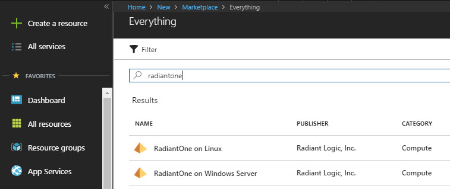
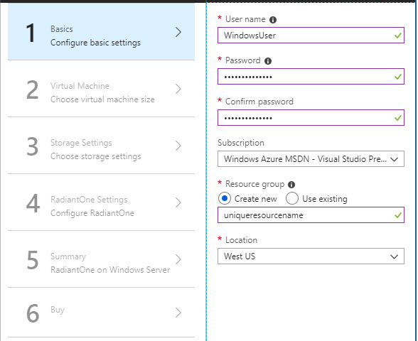
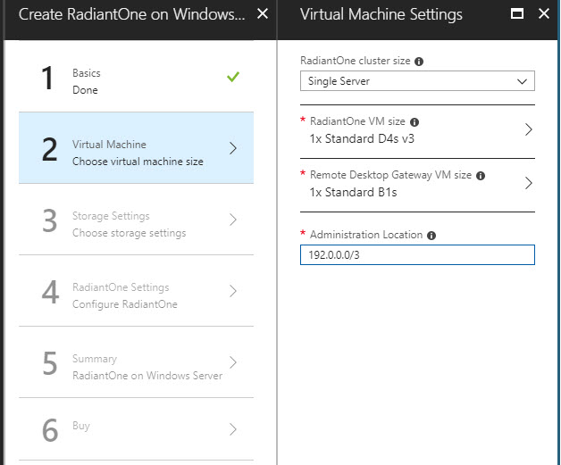
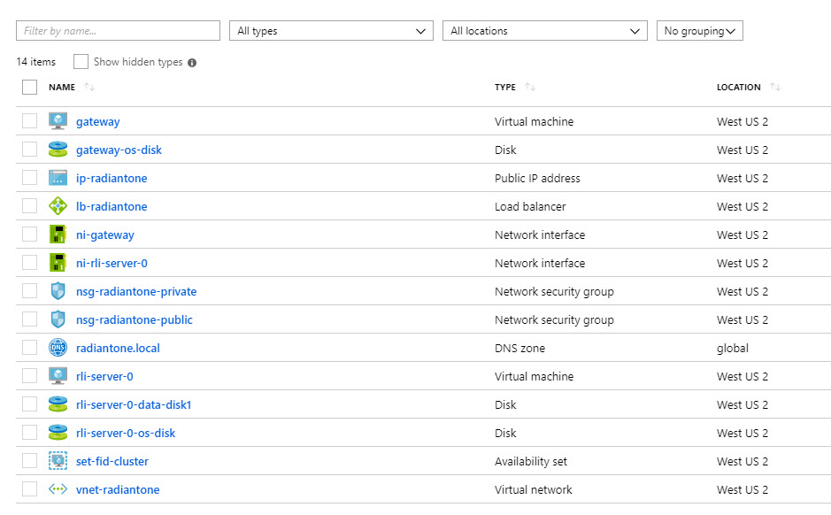

# Chapter 2: Installation

Radiant Logic offers templates for the following types of RadiantOne architectures:

- Single server
- 3 node cluster
- 5 node cluster

Templates are available for Ubuntu 18.04 LTS, Red Hat Enterprise Linux 7.5, CentOS 7.6, or Windows Server 2016 as the host operating system.

>**IMPORTANT NOTES – the templates provided by Radiant Logic install an approved and supported RadiantOne Azure architecture. This is to ensure that RadiantOne is deployed on a certified architecture. If the provided templates do not meet your needs, please contact support@radiantlogic.com and they will
work with your Radiant Logic Account Manager to assess the required professional services needed (if any) to alter the default templates.**

>**If you deploy a customized architecture without using the certified templates, the Radiant Logic support team might be unable to resolve problems in a timely manner. This can result in additional consultation fees imposed on the customer related to the time required to assess and certify the custom deployment.**

All templates install and configure one [load balancer](#load-balancer) and a remote desktop gateway/jumpbox for secure administrative access. A high-level diagram for a three-node cluster deployment is shown below.

The templates require one VNet, one virtual machine for the Windows Remote Desktop Gateway (RDG) or Linux Jumpbox server, and up to five virtual machines for the RadiantOne nodes.

>**IMPORTANT NOTE – Check your Microsoft Azure limits to ensure you have the resources available. Otherwise, the RadiantOne installation will fail.
  https://docs.microsoft.com/en-us/azure/azure-subscription-service-limits**

To install RadiantOne in Microsoft Azure follow the steps below.

1. Log into the Microsoft Azure Marketplace with your administrator account you want to install RadiantOne. This user should have permission to create virtual machines, configure VNet, subnets, and a load balancer.
2. On the menu on the left side, click Create a resource.
3. In the Search the Marketplace field, enter RadiantOne and press Enter. Search results display as shown below.

4. Select an option from the search results. In the pane that opens on the right, click the Create button. The Create RadiantOne... page displays.
5. Enter a user name. This user name should have access to the virtual machines in your cluster and must be a valid user name in the operating system.
6. [Linux only] Select an authentication type. If you select the Password option, proceed to the next step. If you select SSH public key, enter an RSA public key in the single-line format (starting with “ssh-rsa”) or the multi-line PEM format.

>**Note – you can generate SSH keys using ssh-keygen on Linux and OS X, or PuTTYGen on Windows.**

7. Enter and confirm the password associated with the user name.

>**Note – After installation, when you connect to the RadiantOne server (through the Remote Desktop Gateway), you need to login with these credentials.**

8. Select a subscription option.
9. Click the Create New radio button. In the field below the radio buttons, enter a unique resource name.
10. Select a location.

>**Note – Only US regions are supported. This includes the following regions.**
   **- Central US**
    **- East US**
 **- East US 2**
 **- North Central US**
 **- South Central US**
 **- West Central US**
 **- West US**
 **- West US 2**
 **- US Gov Arizona (Linux Only)**
 **- US Gov Texas (Linux Only)**
 **- US Gov Virginia (Linux Only)**

11. Click the OK button at the bottom of the page. The Virtual Machine Settings page displays.
12. [Linux only] Select an operating system from the drop-down menu.
13. Select your RadiantOne cluster size. Radiant Logic offers Microsoft Azure templates for the following types of RadiantOne architectures:

- Single server
- 3 nodes
- 5 nodes

14. Click the RadiantOne VM size field. The “Choose a size” page displays. Click a virtual machine size for RadiantOne and click the Select button. The VM sizes listed in the table below are the recommended for your RadiantOne license.

| RadiantOne License | Azure VM Types
|-------------------|-------------------|
| 1 million entries | DS3_v2, D4s_v3, F4s_v2, or E4s_v3
| 10 million entries | DS4_v2, D8s_v3, F8s_v2, or E8s_v3
| 30 million entries | DS5_v2, D16s_v3, F16s_v2, or E16s_v3
| 60 million entries | D32s_v3, F32s_v2, or E32s_v3

15. Click the Remote Desktop Gateway (“Jumpbox” on Linux installations) VM size field. The “Choose a size” page displays. Select a virtual machine size for your remote desktop gateway VM and click the Select button.
16. Enter an administration location. This is the IP CIDR from which you must connect to the Remote Desktop Gateway/Jumpbox server. The default value is 0.0.0.0/0.

>**IMPORTANT NOTE – The default value allows connection from any IP address. For this reason, it is strongly recommended that you modify this value.**

17. Click the OK button. The Storage Settings page displays.
18. Select the Premium storage account type (required for better performance of the     RadiantOne service).
19. Select a storage account size. The throughput of the disk is dependent upon the size:  https://docs.microsoft.com/en-us/azure/virtual-machines/windows/premium-    storage#scalability-and-performance-targets
20. Click the OK button. The RadiantOne Settings page displays.
21. Select a RadiantOne version from the drop-down menu.
22. Enter the name of the RadiantOne cluster.
23. In the Administrator Name field, enter the administrator account name (e.g. cn=directory  manager).
24. Enter and confirm a password to use for the Directory Manager account.
25. Enter your unique RadiantOne license key for each cluster node. Each node must have its own license key unless you received a cluster-based license key. If you have a cluster-based license key, the same license key can be used for all cluster nodes. Check with your Radiant Logic representative if you are not sure what kind of license you received.

>**Note – the license key starts with braces (e.g. {xxxx}xxxx....).**

26. Enter the LDAPS port for the RadiantOne service to accept client requests on. This is also the LDAPS port configured in the load balancer. All client requests go through the load balancer on the LDAPS port (or HTTPS port mentioned in the next step). The non-SSL port is not configurable in the template and defaults to 2389. There is no external access allowed to the RadiantOne service on the non-SSL LDAP port.

The templates install self-signed SSL/TLS certificates based on the internal server name that Azure assigns to each node. You can update the environment with CA-signed certificates after the install.

27. Enter the HTTPS port for the RadiantOne service to accept client requests on. This is also the HTTPS port configured in the load balancer. All client requests go through the load balancer on the HTTPS port (or LDAPS port mentioned in the previous step). The non-SSL HTTP port is not configurable in the template and defaults to 8089. There is no external access allowed to the RadiantOne service on the non-SSL HTTP port.
28. Click the OK button to advance to the Summary page.
29. Review the parameters.
30. Click OK.
31. Click Create.

### Microsoft Azure Virtual Machines

To view the virtual machines, click Resource groups on the menu on the left. Click the resource in the Name column. The Name and Type columns indicate if it is a RadiantOne server (e.g. rli-server-0), a remote desktop gateway server (gateway), load balancer (lb-radiantone), and so on.

### Ports Opened

The following ports are opened during the configuration.

- The load balancer listens on the ports LDAPS (1636 by default) and HTTPS (8090 by default), the CIDR IP is 0.0.0.0/0. These ports are configurable in the parameters.
- Azure virtual machines can communicate in between each other on any port.
- On Linux, the jumpbox is accessible on port 22 (SSH) from the CIDR IP provided in theparameter Administration Location of the resource creation process.
- On Windows, the Remove Desktop Gateway is accessible on port 443 (HTTPS) from the CIDR IP provided in the parameter Administration Location of the Cloud Formation Stack. There is also a temporary port 3389 (RDP) opened but must be removed
manually in post deployment.

### Load Balancer

The Microsoft Azure load balancer automatically scales its request handling capacity to meet the demands of application traffic. Additionally, load balancing offers integration with Auto Scaling to ensure that you have back-end capacity to meet varying levels of traffic levels without requiring manual intervention. The RadiantOne templates install one load balancer. Client applications should query the load balancer to reach the RadiantOne service. The load balancer distributes client load across RadiantOne cluster nodes.

To view the settings for the load balancer configured, from Resource Groups, select your resource group in the Name column. Locate the load balancer and click the link in the Name column.

In the overview, you can see the public IP address for the load balancer. This is what client applications should point to, to use the RadianOne service.

### Remote Desktop Gateway/Jumpbox

A remote desktop gateway (on Windows) or jumpbox (on Linux), is a special purpose server instance that is designed to be the primary access point from the Internet and acts as a proxy to your other Azure virtual machines.

To view the settings for jumpbox servers configured, from the Favorites menu on the left, select Resource Groups. Click on the Resource Group name link, and then click the “gateway” (“jumpbox” in Linux environments) link. Take note of the IP address as you will need it to connect to the gateway.

### Post-Deployment Tasks (Windows Server Only)

Perform the following instructions to complete the configuration of your Azure environment.

1. Install a valid SSL certificate on the remote desktop gateway server. This certificate should be trusted on the administrative client machine.
2. In your resource group, click “lb-radiantone”.
3. Select inbound NAT rules.
4. Right click "loadBalancer-inbound-nat-rdp-temporary” and click Delete.
5. Click Yes to verify the deletion.
