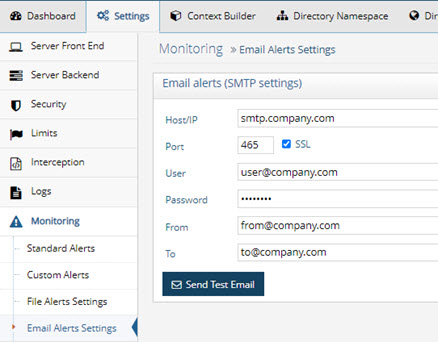
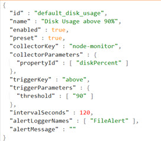

# Chapter 15: Monitoring and Alert Settings Commands

Monitoring and alert settings are managed from the Main Control Panel > Settings tab > Monitoring section and can also be managed from command line using the <RLI_HOME>/bin/vdsconfig utility.



This chapter explains how to manage alerts and email alert settings using commands instead of the GUI mentioned above.

## list-alerts

This command displays all alerts that are configured. An example of the default configuration for disk usage alert is shown below.

>**NOTE – This command does not support output format configuration. Refer to [Configuring Command Output Format](01-introduction.md#configuring-command-output-format) for more information.**



**REST (ADAP) Example**
In the following example, a request is made to display all configured alerts.

```
https://<rli_server_name>:8090/adap/util?action=vdsconfig&commandname=list-alerts
```

## new-alert

This command allows you to configure a new alert.

>**NOTE – This command does not support output format configuration. Refer to [Configuring Command Output Format](01-introduction.md#configuring-command-output-format) for more information.**

An example of creating an alert that returns the information from the node-monitor data collector for a given node is: vdsconfig.bat new-alert -d node-monitor -p nodeId:4ef6b4c3-a56f-4cd0- 853f-b054c5e851a3 -t not-equals -g isVdsRunning:false -i 60 -e true -n "My Custom Alert" -o FileAlert,EmailAlert

**Usage:**
<br>`new-alert -d <data collector key> [-p <data property>] -t <trigger type> [-g <key:value>] - i <seconds> [-e <enabled>] [-n <alert name>] [-o <output type>] [-m <alert message>]`

**Command Arguments:**

**`- d <data collector key>`**
<br>This indicates the data collector that returns the information needed for your monitoring needs. The possible values are: active-alerts, cloud-replication, cluster-info, cluster-latency, cluster- ldap, cluster-zk, connections-info, datasource-status, event-log, hdap-store, pipeline, node-info, node-monitor, node-status, process-info, server-event. For details on each data collector, see the RadiantOne Monitoring and Reporting Guide.

**`- p <data property>`**
<br>Indicates the property to collect. Each data collector returns different properties. For details on possible properties for each data collector, see the RadiantOne Monitoring and Reporting Guide.

**`- t <trigger type>`**
<br>This indicates the type of trigger that activates the alert. The possible values are: above, always, below, equals, or not-equals.

**`- g <key:value>`**
<br>This indicates the trigger parameter. An example is: -g isVdsRunning:false which means the
RadiantOne service is not running and this could be a condition to trigger an alert.

**`- i <seconds>`**
<br>This is the monitoring polling interval in seconds.

**`- e <enabled>`**
<br>This indicates if the alert is active or not. A value of true indicates it is active. A value of false
indicates it is not active.

**`- n <alert name>`**
<br>The name of the alert. This value must be unique across all alerts.

**`- o <output type>`**
<br>This indicates if the output is a file and/or email. Use a value of FileAlert if you want the output to be a file. Use a value of EmailAlert if you want the output to be an email. For both output types, use: -o FileAlert,EmailAlert

**`- m <alert message> `**
<br>This indicates the message to include in the alert. An example would be: -m "RadiantOne is not running on node 4ef6b4c3-a56f-4cd0-853f-b054c5e851a3".

**REST (ADAP) Example**

In the following example, a request is made to create a custom alert for when the state of the RadiantOne on a given node changes (e.g. changes from started to stopped).

```
https://<rli_server_name>:8090/adap/util?action=vdsconfig&commandname=new-alert&d=node-monitor&t=not-equals&g=isVdsRunning:false&i=60&e=true&n="My CustomAlert"&o=FileAlert,EmailAlert&p=nodeId:a9251b17-151c-45ed-a70a-2d3afc614743
```

## edit-alert

This command allows you to edit an alert.


>**NOTE – This command does not support output format configuration. Refer to [Configuring Command Output Format](01-introduction.md#configuring-command-output-format) for more information.**

An example of editing an alert is: vdsconfig.bat edit-alert -x e7dd5763-40eb-4b5c-8799-c6a46cde86ef -g isVdsRunning:true -m "New custom message"

**Usage:**
<br>`edit-alert -x <alert ID> [-d <data collector key>] [-p <data property>] [-t <trigger type>] [-g <key:value>] [-i <seconds>] [-e <enabled>] [-n <alert name>] [-o <output type>] [-m <alert message>]`

**Command Arguments:**

**`- x <alert ID>`**
<br>The identifier of the alert to be edited. Run list-alerts to get the ID of the alert to pass in the -x argument.

**`- d <data collector key>`**
<br>This indicates the data collector that returns the information needed for your monitoring needs. The possible values are: active-alerts, cloud-replication, cluster-info, cluster-latency, cluster-ldap, cluster-zk, connections-info, datasource-status, event-log, hdap-store, pipeline, node-info, node-monitor, node-status, process-info, server-event. For details on each data collector, see the RadiantOne Monitoring and Reporting Guide.

**`- p <data property>`**
<br>Indicates the property to collect. Each data collector returns different properties. For details on possible properties for each data collector, see the RadiantOne Monitoring and Reporting Guide.

**`- t <trigger type>`**
<br>This indicates the type of trigger that activates the alert. The possible values are above, always, below, equals, or not-equals.

**`- g <key:value>`**
<br>This indicates the trigger parameter. An example is: -g isVdsRunning:false which means the RadiantOne service is not running and this could be a condition to trigger an alert.

**`- i <seconds>`**
<br>This is the monitoring polling interval in seconds.

**`- e <enabled>`**
<br>This indicates if the alert is active or not. A value of true indicates it is active. A value of false indicates it is not active.

**`- n <alert name>`**
<br>The name of the alert. This value must be unique across all alerts.

**`- o <output type>`**
<br>This indicates if the output is a file and/or email. Use a value of FileAlert if you want the output to be a file. Use a value of EmailAlert if you want the output to be an email. For both output types, use: -o FileAlert,EmailAlert

**`- m <alert message>`**
<br>This indicates the message to include in the alert. An example would be: -m "RadiantOne is not running on node 4ef6b4c3-a56f-4cd0-853f-b054c5e851a3".

**REST (ADAP) Example**
In the following example, a request is made to edit the message that is sent in a custom alert.

```
https://<rli_server_name>:8090/adap/util?action=vdsconfig&commandname=edit-alert&x=9f53386f-4768-4894-8148-a4426f0ffdb2&g=isVdsRunning:true&m="New custom message"
```

## delete-alert

This command allows you to delete an alert.

>**NOTE – This command does not support output format configuration. Refer to [Configuring Command Output Format](01-introduction.md#configuring-command-output-format) for more information.**

An example of deleting an alert is: vdsconfig.bat delete-alert -x e7dd5763-40eb-4b5c-8799-c6a46cde86ef

**Usage:**
<br>`delete-alert -x <alert ID>`

**Command Arguments:**

**`- x <alert ID>`**
<br>The identifier of the alert to be deleted. Run list-alerts to get the ID of the alert to pass in the -x argument.

**REST (ADAP) Example**

In the following example, a request is made to delete an alert.

```
https://<rli_server_name>:8090/adap/util?action=vdsconfig&commandname=delete-alert&x=9f53386f-4768-4894-8148-a4426f0ffdb2
```

## get-email-prop

This command displays the current properties for email alerts.

**Usage:**
<br>`get-email-prop [-instance <instance>]`

**Command Arguments:**

**`- instance <instance>`**
<br>The name of the RadiantOne instance. If not specified, the default instance named vds_server is used.

**REST (ADAP) Example**

In the following example, a request is made to display the current properties for email alerts.

```
https://<rli_server_name>:8090/adap/util?action=vdsconfig&commandname=get-email-prop
```

## set-email-prop

This command. sets the properties for email alerts.

**Usage:**
<br>`set-email-prop [-propfile <propfile>] [-instance <instance>]`

**Command Arguments:**

**`- propfile <propfile>`**
<br>[required] The full path to a file containing the property names and values to set for email alerts. The following names are accepted: subject, recipient, from, protocol, enablessl, host, port, username, password.

**`- instance <instance>`**
The name of the RadiantOne instance. If not specified, the default instance named vds_server is used.

**REST (ADAP) Example**

In the following example, a request is made to set properties for email alerts.

```
https://<rli_server_name>:8090/adap/util?action=vdsconfig&commandname=set-email-prop&propfile=C:\radiantone\vds\vds_server\email.properties
```
