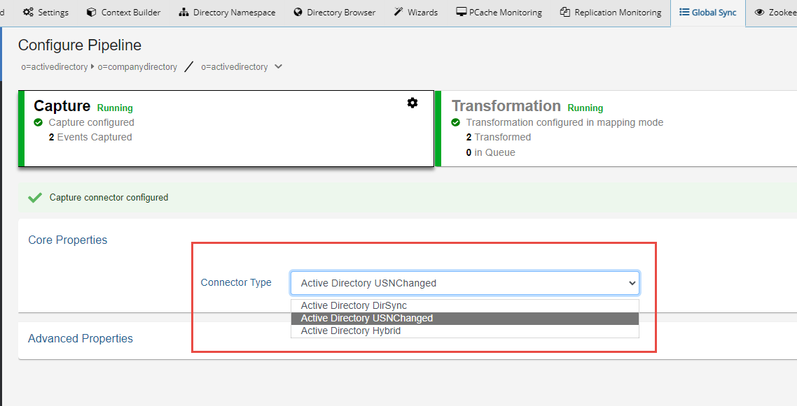
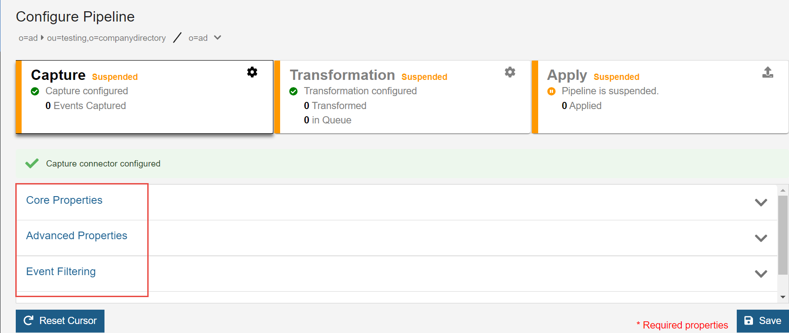

# Chapter 2 - Configuring Capture Connector Types and Properties

The process of configuring connector properties and the property definitions described throughout the rest of this section are applicable to all connector types.

Connector types and properties are configured from the Main Control Panel -> Global Sync tab. Select the topology on the left and then click **Configure** next to the pipeline. In the pipeline configuration, select the **capture** component.

The capture connector type is configured in the Core Properties section at the bottom.

Figure 2. 1: Connector Type Configuration

Connector Properties are configured in the Core Properties, Advanced Properties, Event Filtering, and Event Contents sections. Not all connector types have all sections.

Figure 2. 2: Connector Properties

## Common Properties for All Connectors

The following properties are supported for all connectors (unless otherwise specified). Although common, these properties are not shared. You must configure these properties for each connector.

>[!note]
>Boolean properties values are not case-sensitive.

### Log Level

Log level 0: OFF  
Log level 1: ERROR  
Log level 2: WARN  
Log level 3: INFO  
Log level 4: DEBUG  
Log level 5: TRACE

**Location of Log Files**  
Connector log files are located at:
`\<RLI_HOME\>\logs\sync_agents\\\<pipeline_name\>\connector.log` on the RadiantOne node where the sync agent is running. Run `\<RLI_HOME\>/bin/monitoring.bat (.sh on Linux) -d pipeline` to locate your sync process and the value of the `captureHostname` propertyId value indicates the machine where the connector.log is located.

These logs are helpful in determining if changes are being captured and if there were any errors.

### Polling Interval

The only capture type that does not use the polling interval property is the LDAP Persistent Search Connector.

This property indicates the amount of time (in milliseconds) the connector should wait before querying the source to check for changes.

>[!note]
>This property can be updated while the connector is running and will take effect without restarting the connector.

### Size Limit

This property indicates the number of entries the connector collects from the source in a single request (poll). Even if the connector picks up multiple entries, they are processed and published to the queue one at a time.

### Max Retries on Connection Error

For Database Connectors, if the connector is unable to connect to the primary backend server, it tries to connect to the failover server. If the connector cannot connect to the primary or failover servers because of a connection error, it tries to connect again later. Maximum Retries on Connection Error is the total number of times the connector tries reconnecting. A failed attempt to connect to both the primary and failover server is considered a single retry. The frequency of the reconnect attempt is based on the Retry Interval on Connection Error property. If there are no backends available to connect to, the agent automatically redeploys the connector until a connection to the backend can be made.

For Directory Connectors, if the connector is unable to connect to the primary backend server because of a connection error, it tries to connect again later. Maximum Retries on Connection Error is the total number of times the connector tries reconnecting. The frequency of the reconnect attempt is based on the Retry Interval on Connection Error property. After all attempts have been tried, the connector failover logic is triggered. If there are no backends available to connect to, the agent automatically redeploys the connector until a connection to the backend can be made.

The default value is `5`.

### Retry Interval on Connection Error

Used in conjunction with the Max Retries on Connection Error property. This is the amount of time (in milliseconds) the connector waits before trying to establish a connection to the source if there was a connection problem during the previous attempt.

The default value is `10,000 ms` (10 seconds).

### Max Retries on Error

If the connector is unable to connect to the source to pick up changes for any reason other than a connection error, it tries to reconnect. Maximum Retries on Error is the total number of times the connector tries reconnecting. The frequency of the reconnect attempt is based on the Retry Interval on Error property. After all attempts have been tried, the connector failover logic is triggered. If there are no backends available to connect to, the agent automatically redeploys the connector until a connection to the backend can be made.

The default value is `5`.

### Retry Interval on Error

Used in conjunction with the Max Retries on Error property. This is the amount of time (in milliseconds) the connector waits before it attempts to pick up changes from the source after an error has occurred.

The default value is `10,000 ms` (10 seconds).

### Event Contents

The properties that determine the attributes that are published in the message can be found in the Event Contents section. Transformation logic (scripting and/or attribute mapping) is based on the attributes published for the entries, so ensure all source attributes you want to use in the transformation are published by the connector.

#### Granular Per Event Type Mode

The contents of the message published by the connector can be configured by the event type (Add, Modify, Delete). If "Granular per Event Type Mode" is enabled, you can configure the attributes the connector should publish in the message depending on the type of event detected. Enabling this mode adds a configuration section for each type: add, modify, delete. If this mode is disabled, the connector publishes the same set of attributes regardless of event type.

#### Request All Attributes

The Request all Attributes property is enabled by default. When a connector picks up changed entries, the default behavior is to request and publish all attributes of the entry. For LDAP/Active Directory sources, this does not include operational attributes. If you want operational attributes returned, use the [Operational Attributes](#operational-attributes) property. If you want to exclude a few attributes from the entries the connector publishes, use the [Excluded Attributes](#excluded-attributes) property. If your synchronization use case does not require all attributes of the changed entries, you can disable the "Request all Attributes" and enter the specific attributes of interest in the [Requested Attributes](#requested-attributes) property.

##### Operational Attributes

This property is available when Request all Attributes is enabled. Enter a comma-separated list of operational attributes that the connector should request (and publish) when it picks up changed entries.

##### Excluded Attributes

This property is available when Request all Attributes is enabled. To further condition the content of the entries that are published, you can indicate to have certain attributes excluded from the message. In the Excluded Attributes property, enter a comma-separated list of attribute names that should not be published in the message by the connector. This can reduce the size of the message that is published and avoid publishing unwanted information.

##### Requested Attributes

If the Request all Attributes property is disabled, you must list the attributes that the connector should request and publish for the changed entries in the Requested Attributes property.
