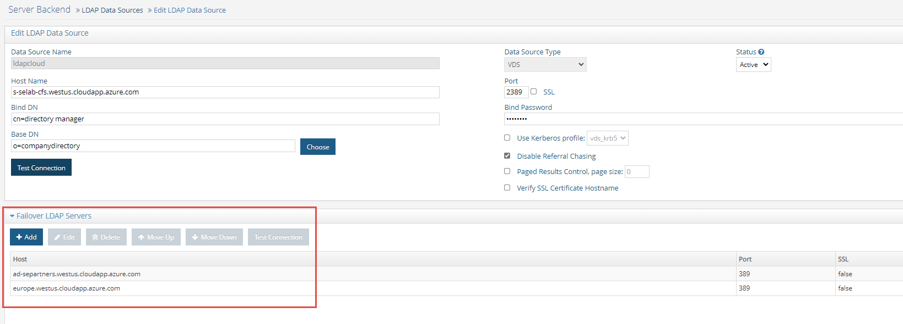
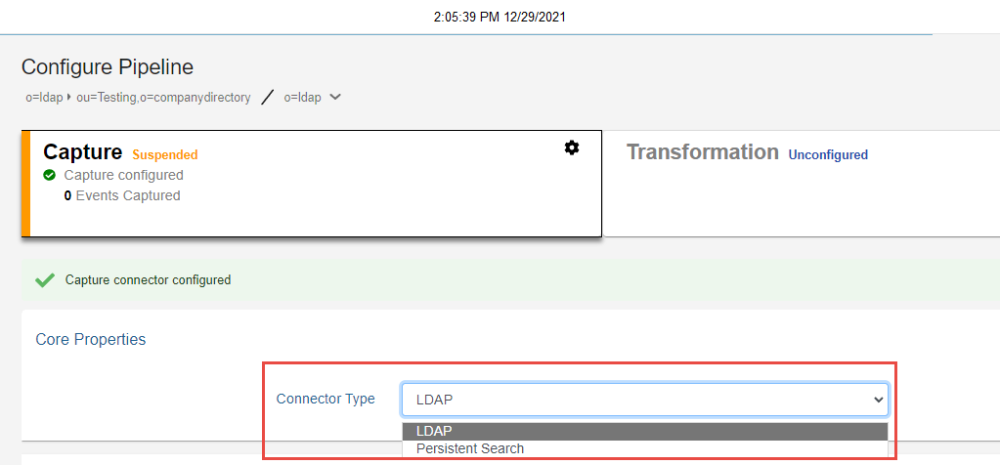

# Chapter 3: LDAP Connectors

There are two types of LDAP connectors: Changelog and Persistent Search. These connector types are described in this chapter.

## LDAP (Changelog) Connector

Any LDAP directory that offers a changelog can use the LDAP connector type. This includes the RadiantOne service.

For the changelog functionality, some directories like Oracle ODSEE, must have the changelog and retro changelog plug-in enabled. The connector polls the changelog based on the changelog polling interval parameter. The connector internally keeps track of the last processed change and only processes new changes. If the connector is shut down (either deliberately or due to failure) it can read the changelog and capture all changes that occurred while the connector was offline.

A special user (that represents the "connector" user) must exist in the directory. This user must have sufficient rights for detecting changes (reading the changelog). When defining the data source associated with the LDAP (source) backend, enter this user in the connection parameter.

## LDAP Persistent Search Connector

The Persistent Search connector issues a persistent search and gets notified by the directory server when data changes. For directories that offer persistent search, no special configuration is required to enable this function on the LDAP server. If the connector is shut down (either deliberately or due to failure), the delete operations that occurred on the directory are lost. Once the connector is back online there is no way to retrieve the delete operations that occurred while it was down. The only exception to this is for IBM TDS directories. It stores deleted entries and the capture connector is able to read them, and based on timestamp, determine if the change occurred while the connector was offline.

Any LDAP directory that offers a persistent search mechanism can use the Persistent Search connector type. Novell eDirectory is an example of an LDAP source that supports persistent search. Others include Red Hat Directory, IBM TDS, and CA Directory.

## LDAP Connector Failover

The LDAP connectors can leverage a failover backend that has been configured for the data source. When you configure a data source for your backend directory, indicate one or more failover servers. An example is shown below.

Figure 3. 1: Configuring a Failover Server for the Backend Directory

If a connection cannot be made to the primary server, after the maximum number of retries is exhausted, the connector connects to the failover server.

This failover mechanism is supported for OpenDJ, Oracle Directory Server Enterprise Edition (Sun Directory), Oracle Unified Directory (OUD), Novell eDirectory, IBM Tivoli Directory (TDS), CA Directory, Red Hat Directory, and RadiantOne Universal Directory. In addition, any LDAP directory implementing `cn=changelog` and `replicationCSN` attribute should also be supported.

>[!important]
>The backend servers must be configured for multi-master replication. Please check the vendor documentation for assistance with configuring replication for your backends.

## Configuration

Set the connector type in the pipeline configuration by clicking the **Capture** component. In the Core Properties section, select the connector type from the drop-down list.

Figure 3. 2: Selecting Connector Type

After selecting the Connector Type, configure the connector properties. For properties common to all connectors, see [Chapter 2](02-configuring-connector-types-and-properties.md#common-properties-for-all-connectors). The general properties for LDAP connectors are configured in the Core Properties section. Properties related to filtering of events are configured in the Event Filtering section. Properties related to the contents of the messages published by the connector are configured in the [Event Content](02-configuring-connector-types-and-properties.md#event-contents) section. All other properties are configured in the Advanced Properties section. [Polling interval](02-configuring-connector-types-and-properties.md#polling-interval)is not required for the LDAP Persistent Search connector. For properties that determine how the connector filters events that aren't needed, configure the LDAP Filter, Included Branches and Excluded Branches in the Event Filtering section. These properties are described below.

### LDAP Filter

To further condition the entries that are published, you can indicate the desired criteria in the `LDAP Filter` property. This is a post filter, used to qualify which entries are published by the connector. You must enter a valid LDAP filter in the property.

This property can be used to avoid publishing unwanted information.

If a captured entry matches the criteria indicated in the LDAP filter property, it is published by the connector. If it doesn't, the entry is not published.

If the captured change type is delete, and not enough information is known about the entry, the LDAP filter is not used and the entry is published by the connector. For example, if the LDAP filter property contained a value of `(l=Novato)` and the captured entry did not contain an `l` attribute, the LDAP filter is not applied and the entry is published.

If the captured change type is not delete (e.g. insert, update, move…etc.), and not enough information is known about the entry, the LDAP filter is still used and the entry is not published. For example, if the LDAP filter property contained a value of `(l=Novato)` and the captured entry did not contain an `l` attribute, the LDAP filter is still applied and the entry is not published by the connector.

>[!note]
>If a change is made to this property while the connector is running, it must be restarted for the new value to take effect.

### Excluded Branches

To further condition the entries that are published, you can indicate one or more branches to exclude. In the Excluded Branches property, enter one or more suffixes associated with entries that should not be published by the connector. Click **Enter** after each suffix. An example is shown below.

If the changed entry DN contains a suffix that matches the excluded branches value, or is a change in the exact entry that is listed (e.g. `ou=dept1,ou=com`), this entry is not published by the connector. Otherwise, the entry is published. This can avoid publishing unwanted information.

>[!note]
>If both included and excluded branches are used, an entry must satisfy the conditions defined in both settings to be included in the message. The included branches condition(s) is checked first.**
>If you set this value using the vdsconfig command line utility on Windows, separate the branches with a comma. E.g. `C:\radiantone\vds\bin\>vdsconfig.bat set-connector-property -connectorname o_sead_pcache_proxy\_\_dc_seradiant_dc_dom\_\_seradiantad -propertyid excludedBranches`
>`-propertyvalue "\[\\"cn=users,dc=seradiant,dc=dom\\",\\"cn=domain groups,dc=seradiant,dc=dom\\"\]".`

If a change is made to this property while the connector is running, the new value is taken into account once the connector re-initializes which happens automatically every 20 seconds.

### Included Branches

To further condition the entries that are published, you can indicate one or more branches to include. In the Included Branches property, enter one or more suffixes associated with entries that should be published by the connector. Click **Enter** after each suffix. An example is shown below.

If the changed entry DN contains a suffix that matches the included branches value, or is a change in the exact entry that is listed (e.g. `ou=dept1,ou=com`), this entry is published by the connector. Otherwise, the entry is not published. This can avoid publishing unwanted
information.

>[!note]
>If both included and excluded branches are used, an entry must satisfy the conditions defined in both settings to be included in the message. The included branches condition(s) is checked first.
>If you set this value using the vdsconfig command line utility on Windows, separate the branches with a comma. E.g. `C:\radiantone\vds\bin\>vdsconfig.bat set-connector-property -connectorname o_sead_pcache_proxy\_\_dc_seradiant_dc_dom\_\_seradiantad -propertyid includedBranches`
>`-propertyvalue "\[\\"cn=users,dc=seradiant,dc=dom\\",\\"cn=domaingroups,dc=seradiant,dc=dom\\"\]"`

If a change is made to this property while the connector is running, the new value is taken into account once the connector re-initializes which happens automatically every 20 seconds.

### Switch to Primary Server (in Polling Intervals)

This option is relevant for the LDAP changelog connector type.

This option, working in conjunction with the Polling Interval property, allows you to configure how often, if at all, the connector attempts to switch back to the primary server after failover.

To configure the connector to attempt to switch to the primary server, set Switch to Primary Server to a value of `4` or greater. You can set the value to less than `4`, but attempting to connect back to the primary server can be time consuming and therefore not recommended to do frequently. For example, if this value is set to `1`, the connector makes an attempt every polling interval. If the Switch to Primary Server value is `3`, the connector makes an attempt every third polling interval.

To disable attempts to reconnect to the primary server, set this value to `zero`. This is the default value.

Changes made to this property's value while the connector is running are immediately taken into account. When the connector starts or restarts and the property value is `1` or higher, the connector attempts to switch to the primary server immediately.

### Failover Algorithm

This option is relevant for the LDAP changelog connector type.

When a failover happens, the changelog capture connector attempts to find a new cursor. Since this process is inexact, and changenumber sequence can vary across some replica servers, some events may be replayed or lost. The changelog connector maintains a cursor that indicates information related to the last change processed by the connector along with information about possible replica servers in case failover is needed. During failover, the connector searches the changelog of the replica servers and determines minimum and maximum changenumbers across them. Assume that the last processed changenumber stored by the connector is 100 and there are 2 replica servers defined for the backend. During failover, the connector determines the current changenumbers for each of the replicas by searching their changelogs. Assume that replica 1 has changenumber 99 and replica 2 has changenumber 97. When the connector needs to failover, it must decide whether to start processing changes using changenumber 100 (its current last processed change), 97 (changenumber from replica 2), or 99 (changenumber from replica 1).

The `Failover Algorithm` property allows you to determine how the cursor value gets set during failover, and ultimately determine the quantity of events that are replayed. The property supports values between `1` and `4`. The meaning of each is outlined in the table below.

| Value | Function | Set this value if…. |
|---|---|---|
| 1 | Sets cursor to the minimum changenumber based on the current changelog numbers of the replica servers. In the example described above, changenumber of 97 is used. This is the default setting. | You do not want to lose any events. This may result in many events being replayed. |
| 2 | Sets cursor to maximum changenumber based on the current changelog numbers of the replica servers. In the example described above, changenumber of 99 is used. | You want to minimize the replaying of events during failover. This may result in some events being lost. |
| 3 | The cursor is not changed. The exact last processed changed stored in the connector cursor would be used. In the example described above, changenumber of 100 is used. | You know that the LDAP servers in the replica have the same changeNumber in `cn=changelog`. For example, all RadiantOne nodes in a cluster have the same changeNumber in `cn=changelog`. |
| 4 | Sets cursor to the last changenumber of the failover server. In the example described above, if replica 1 is the failover server that gets used, changenumber of 99 is used. If replica 2 is the failover server, changenumber of 97 is used. | You do not want to replay any events during failover. This may result in the loss of many events. |
