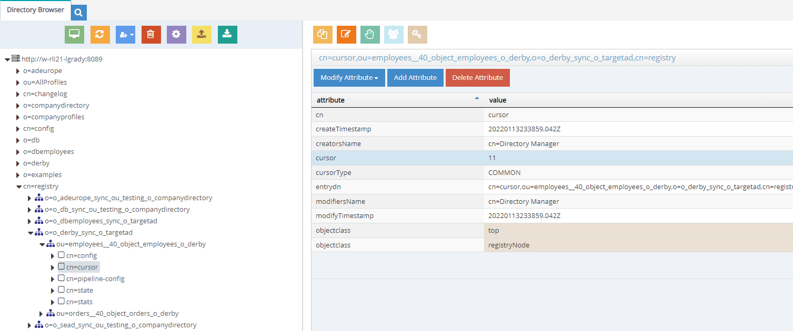

# Overview

Connectors are used for synchronization in the RadiantOne Global Sync module and have three main functions.

1. Query data sources and collect changed entries.
1. Filter unneeded events.
1. Publish changed entries with the required information (requested attributes).

This document provides a brief introduction to the RadiantOne Global Sync module's architecture and some common topics applicable for all connectors like how to reset the cursor and message size. Other documents in this guide focus on specific connectors per data source type.

## About this manual

Connectors are components responsible for capturing changes on entries in data sources and are used by the RadiantOne Global Sync module to propagate changes from source systems to one or more targets systems.

Depending on the source data store type (e.g. LDAP directory, Active Directory, RDBMS), different connectors are available. This guide provides information about each connector type and their corresponding configurable properties.

## Audience

This manual is intended for administrators who are responsible for tuning and deploying the RadiantOne Global Sync module. This manual assumes that the reader is familiar with the following:

- SQL Queries
- LDAP Queries
- TCP/IP Connections
- LDAP failover and load balancing

## Technical support

Refer to the [Technical support guide](../common-info/technical-support.md) for more information.

## Introduction to connectors

RadiantOne includes connectors for databases and directories. A connector is an adapter for one catalog/object per data source that can be configured to listen for changes. Some examples are:

- A SQL Server connector for database/catalog PUBS
- An Oracle connector for database owner SCOTT
- An LDAP connector for the inetOrgPerson object class in the schema

For databases, there are three capture connector types: Counter, Changelog (Triggers-based), or Timestamp.

For LDAP directories, there are two connector type options: LDAP (changelog), or Persistent Search.

For Active Directory, there are three connector type options: AD USNChanged, AD DirSync, and AD Hybrid.

Capture connectors publish change messages to queues. A sync engine receives notification when messages are in a queue, applies transformation to the message (based on attribute mappings and or scripting) and sends the transformed message to the destination.

A high-level architecture is shown below.


## Reset connector cursor – detect new changes only

Capture connectors use a cursor to maintain information about the last processed change. This allows the connectors to capture only changes that have happened since the last time they processed changes. When the capture connectors start, they automatically attempt to capture all changes that have happened since the last time they checked. If the synchronization process has been stopped for an extended period, you might not want them to capture all missed changes. In this case, you can reset the cursor for the connector. You can reset the cursor from command line or from the Main Control Panel > Global Sync tab. Each option is described below.

### Global Sync tab

On the Main Control Panel > Global Sync tab, choose the topology on the left. Select **Configure** next to the pipeline on the right. Choose the **Capture** component and select **Reset Cursor** shown below the properties. An example is shown below.


### Command line

To reset the cursor, run the following command to locate the Pipelines Identifier for your topology: `{RLI_HOME}/bin/vdsconfig list-topologies`

Once you have the Pipelines Identifier, run the following command to reset the cursor for the capture connector: `{RLI_HOME}/bin/vdsconfig reset-cursor -pipelineid {PIPELINES_IDENTIFIER}`

An example is shown below (log output was removed to simplify the response):

```sh
C:\radiantone\vds\bin>vdsconfig reset-cursor -pipelineid
o_activedirectory_sync_o_companydirectory_pipeline_o_activedirectory

{

 "success" : true,

 "data" : "The pipeline connector
<o_activedirectory_sync_o_companydirectory_pipeline_o_activedirectory>
has been successfully reset."

}
```

## Manually update connector cursor

Each connector stores a cursor to maintain information about the last processed change. In some cases, you may need to edit the cursor value to force the connector to pick up some missed changes (during a disaster recovery scenario where you will start synchronization in another data center), or skip some changes in cases like where [non-sequential change IDs](database-timestamp-connector.md#force-sequential-counters) were detected. Connector configuration is stored in a RadiantOne Universal Directory store mounted at the `cn=registry` naming context.

>[!note]
>Editing the cursor is supported for connectors that store a number or timestamp value. The AD DirSync and Hybrid connectors use a cookie for a cursor value that you would not know how to set.

1. Stop the capture connector by suspending the pipeline. You can do this from the Main Control Panel > Global Sync tab, or using the vdsconfig command line utility, `change-pipeline-state` command.
1. Connect to RadiantOne with an administrator that has permissions to modify entries in `cn=registry` and browse to the configuration for your capture connector: `cn=cursor,{PIPELINE_ID},cn=registry`
1. Edit the cursor attribute and enter the value to indicate the point from which the connector should capture changes from. An example for a database changelog connector is shown below.
    
1. Resume the pipeline which redeploys/starts the connector. You can do this from the Main Control Panel > Global Sync tab, or using the vdsconfig command line utility, `change-pipeline-state` command.

## Message size

Each message published by the connector contains one changed entry. Multiple changed entries are not packaged into a single message. The [requested attributes](configure-connector-types-and-properties.md#request-all-attributes) configured for the connector dictate the contents of the message and as a result, the message size.

To learn more about connectors, please read the document that describes the the high-level process of [configuring connector types and properties](configure-connector-types-and-properties.md) that are used by all connectors.
