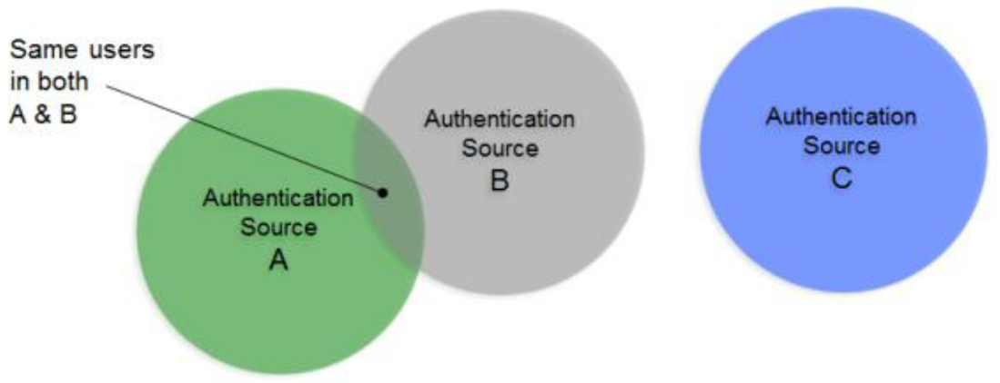
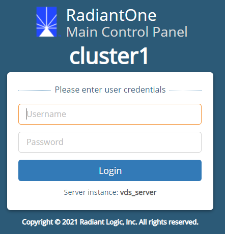

# Introduction

If you don't have a single source of users, an application would have to look in all the different data stores across the enterprise to find a particular user. Even if a user is listed in only one store (unless that exact store is already known), an application still needs to locate them, resulting in multiple queries issued (at least one to each source the user could potentially be located in). However, if you have a master index (an "identity hub"), the application only needs to query this list to locate a user, which results in queries to only the backend stores where the user is located. The more sources involved, the more valuable this global index is. It is this global list that is created and maintained by RadiantOne.

In cases where the data stores contain user overlap, the RadiantOne service performs aggregation and correlation, creating a common key to identify users across disparate systems. However, the union operation is still important for data sources that may or may not have identity intersection. If they do not have identity overlap there is no need for correlation, but the function of union is still crucial for building your identity service.

The diagrams below provide a summary/review of data sources containing duplicate/intersecting identities.

In the first scenario, the data sources have no overlap of identities. In this scenario the benefits of union would still be important for identity management since a single unique index/list is still required for applications to identify a user for authentication. However, the design effort is a bit easier as no correlation logic is required. An aggregation of sources A, B, and C is sufficient, so the primary design consideration in this case is what hierarchy applications are expecting and to build this namespace accordingly.

Data Sources with No Overlapping Identities

In cases where there starts to be user overlap (as seen in Sources A and B in the diagram below), the configuration starts to require correlation. In this scenario, an aggregation of users from sources A, B and C is required in addition to correlation for the overlapping users in sources A and B. The design considerations now involve correlation logic in addition to where you want the unique list of users to appear in the virtual namespace.

Data Sources with No Overlapping Identities

In scenarios where the number of data sources increases, the amount of overlapping identities varies (as depicted in the diagram below), and the logic required to correlate identities becomes complex with the possible need of cascading rules to determine correlation, the RadiantOne Identity Data Analysis tool analyzes the quality of data in the backends, helping you determine which attributes would be the best candidates for correlation rules. The data analysis tool generates a report for each of your data sources. These reports give you a glimpse of your existing data and provide insight on the quality of your data and what is available for you to use for correlation logic.

Complex Identity Integration Scenario

It is recommended that you use the Data Analysis tool on your data prior to using the Global Identity Builder tool.

>[!important]
>If you have identities in cloud directories/applications or other data sources being accessed through a custom API, you must use RadiantOne to virtualize and persistent cache them prior to using the Global Identity Builder tool. For details on this process, please see [Integrate and Configure a Custom Data Source](#integrate-and-configure-a-custom-data-source).

Once you have a list of your identity sources and ideas about how to correlate overlapping identities, you are ready to use the Global Identity Builder tool to create your global profile view/reference list.

>[!important]
>The virtual view created by the Global Identity Builder is read-only since it is an aggregation/computation of identities and attributes from a variety of heterogeneous data sources. The [Global Identity Viewer](#global-identity-viewer) tool can be used to search/browse the global profile view and offers edit-ability of attributes on the tabs representing the backend data source(s).

The purpose of this guide is to describe how to use the Global Identity Builder tool accessible from the Wizards tab in the RadiantOne Main Control Panel.

## Access the Global Identity Builder Tool

The Global Identity Builder tool is accessible from the Wizards tab in the RadiantOne Main Control Panel.

Any user that is a member of the RadiantOne Directory Administrator role, or the Namespace Admin role can access the tool. For details on the RadiantOne delegated admin roles, see the RadiantOne System Administration Guide.

To access the Global Identity Builder tool, navigate in a web browser to the Main Control Panel associated with the RadiantOne leader node.

`http://{HOST_NAME}:7070/main/login`

Examples include the following.

`http://vdservername:7070/main/login`

`http://10.11.12.10:7070/main/login`

The RadiantOne Main Control Panel Login Page

Enter your credentials and select Login. Go to the Wizards tab and select Global Identity Builder.
